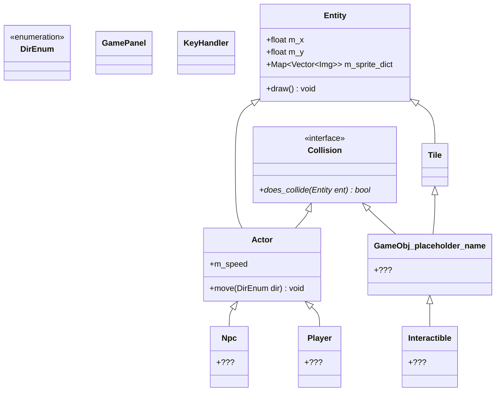

# woolshop
jeu tout choupi

## Diagramme de classes

```mermaid
classDiagram
    
    class DirEnum {    
    }
    <<enumeration>> DirEnum

    class GamePanel {
    }
    
    class KeyHandler {
    }

    class Entity {
        +float m_x
        +float m_y
        +Map~Vector~Img~~ m_sprite_dict
        +draw() void
    }

    class Collision {
        +does_collide(Entity ent)* bool
    }
    <<interface>> Collision

    class Actor {
        +m_speed
        +move(DirEnum dir) void
    }

    class Tile {
    }

    class GameObj_placeholder_name {
        +???
    }

    class Interactible {
        +???
    }

    class Npc {
        +???
    }

    class Player {
        +???
    }

    Entity <|-- Actor
    Collision <|-- Actor

    Entity <|-- Tile

    Collision <|-- GameObj_placeholder_name
    Tile <|-- GameObj_placeholder_name

    GameObj_placeholder_name <|-- Interactible

    Actor <|-- Npc

    Actor <|-- Player
```
