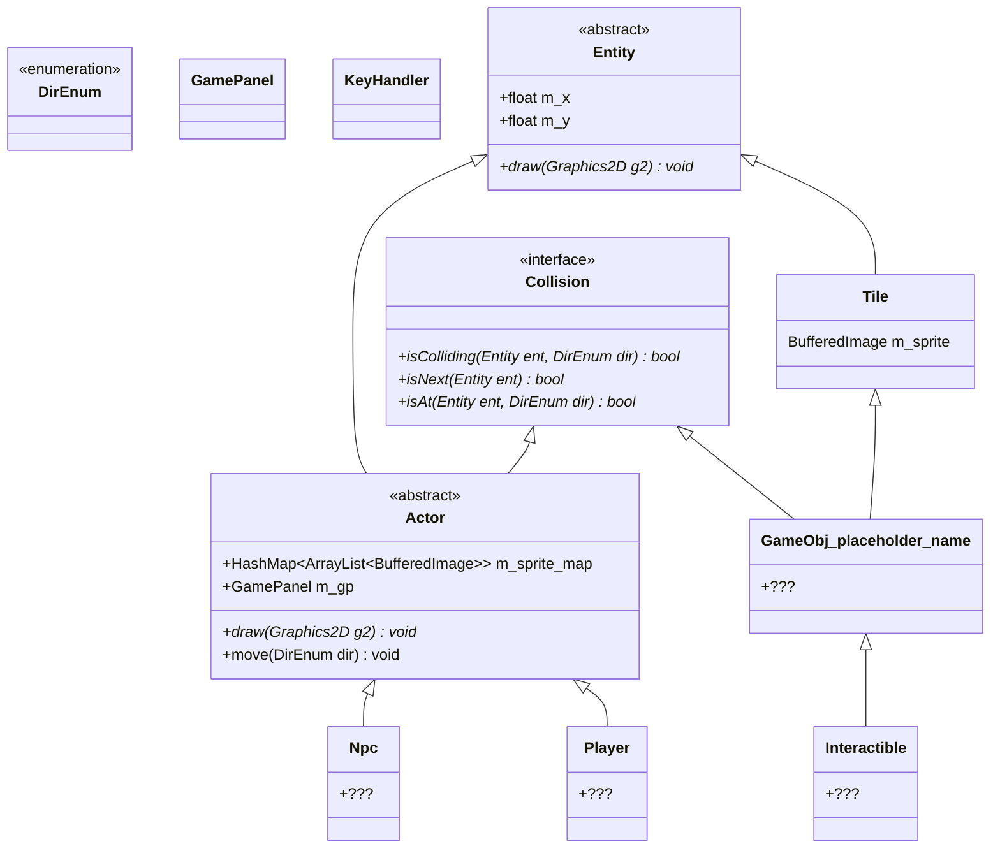

# woolshop
jeu tout choupi

## Diagramme de classes

## Structure du projet
- `bin/` contient les binaires.
- `res/` contient les ressources.
- `src/` contient le code source :
    - `util/` contient des éléments utilitaires.
    - `main/` contient le programme principal.
    - `entity/` contient la classe `Entity` et ses classes filles directes (`Tile` et `Actor`).
    - `tile/` contient les classes filles de `Tile`.
    - `actor/` contient les classes filles de `Actor`.
    - `collision/` contient `Collision`.
